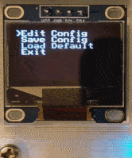

# PicoMK <!-- omit in toc -->

PicoMK is a highly configurable mechanical keyboard firmware designed for Raspberry Pi Foundation's [RP2040](https://www.raspberrypi.com/documentation/microcontrollers/rp2040.html). The chip features two Cortex-M0 processors. Based on the smp branch of [FreeRTOS](https://github.com/FreeRTOS/FreeRTOS-Kernel/tree/smp), PicoMK supports multicore execution on RP2040. It currently powers these boards:

 * [Pico-Keyboard](https://github.com/zli117/Pico-Keyboard)
 * [CyberKeeb2040](https://github.com/zli117/CyberKeeb2040)

## Table of Contents

- [Features](#features)
- [Quick Start](#quick-start)
  - [Get the Code](#get-the-code)
  - [Build a Firmware](#build-a-firmware)
  - [Build and install the Linux Kernel Module (for Raspberry Pi OS)](#build-and-install-the-linux-kernel-module-for-raspberry-pi-os)
- [Documentations](#documentations)
  - [Anatomy of layout.cc](#anatomy-of-layoutcc)
  - [Inter-Board Protocol (IBP)](#inter-board-protocol-ibp)
  - [Devices and Registration Functions](#devices-and-registration-functions)
  - [Configuration Menu](#configuration-menu)
  - [Design and Tradeoffs](#design-and-tradeoffs)
- [Example Configurations](#example-configurations)
- [Future Roadmaps](#future-roadmaps)

# Features

* Configurable keymaps with multiple layers and compile time validation.
* Full [NKRO](https://en.wikipedia.org/wiki/Rollover_(keyboard)) support.
* C++ registration based customization.
* Supports multiple peripherals such as rotary encoder, SSD1306 OLED screen, joysticks, WS2812 LED and more to come.
* Self-contained, runtime configuration menu (screen required). Change keyboard configuration on-the-fly with the keys or the knob.
  
  ||
  |:----:|
  |Turn off LED|
* Arbitrary multiplex scan matrix ([Japanese duplex](https://kbd.news/The-Japanese-duplex-matrix-1391.html), [Charlieplexing](https://en.wikipedia.org/wiki/Charlieplexing) etc.). See [Anatomy of layout.cc](#anatomy-of-layoutcc)
* [Inter-Board Protocol (IBP)](docs/ibp.md) for communication between multiple modules (i.e. Pico <-> Pico, Pico <-> Pi Zero). See [CyberKeeb2040](https://github.com/zli117/CyberKeeb2040) for the demo.

# Quick Start

## Get the Code
This guide assumes you're using one of the followings: Linux (including Raspbian), Windows WSL, MacOS.

First, install the dependencies for pico-sdk

 * Arch Linux:

   ```bash
   pacman -S git cmake arm-none-eabi-gcc
   ```

 * Ubuntu:

   ```bash
   sudo apt update
   sudo apt install cmake gcc-arm-none-eabi libnewlib-arm-none-eabi build-essential libstdc++-arm-none-eabi-newlib
   ```

 * Raspbian:

   Note the installation script requires ~2.5GB of disk space on the SD card. 

   ```bash
   sudo apt install wget
   wget https://raw.githubusercontent.com/raspberrypi/pico-setup/master/pico_setup.sh
   chmod +x pico_setup.sh
   ./pico_setup.sh
   ```

   For details on what this script does, please see Pi Pico [Getting started guide](https://datasheets.raspberrypi.com/pico/getting-started-with-pico.pdf) chapter 1.

 * Alpine:

   ```bash
   apk add git cmake gcc-arm-none-eabi newlib-arm-none-eabi
   ```

 * MacOS:

   ```bash
   # Install Homebrew
   /bin/bash -c "$(curl -fsSL
   https://raw.githubusercontent.com/Homebrew/install/master/install.sh)"
   
   brew install cmake
   brew tap ArmMbed/homebrew-formulae
   brew install arm-none-eabi-gcc
   
   # For M1 Mac only: install Rosetta 2
   /usr/sbin/softwareupdate --install-rosetta --agree-to-license
   ```

Then checkout the code

```bash
git clone https://github.com/zli117/PicoMK.git
cd PicoMK
git submodule update --init && git -C pico-sdk submodule update --init
```
The last command will checkout all the dependencies such as pico-sdk and FreeRTOS, so it might take a while depending on your internet connection.

## Build a Firmware

To create a custom firmware, you can make a copy of the existing config in the `configs/` folder. For this guide, we will copy the default config in `configs/default`. 

```bash
mkdir -p configs/tutorial/my_new_config
cp configs/default/* configs/tutorial/my_new_config
```

Each config consists of two files: `config.h` and `layout.cc`. Please see the comments in the file and the documentations for information on how to configure them.

The following commands builds the firmware:

```bash
mkdir build
cd build
cmake -DBOARD_CONFIG=<board_config> ..
make -j 4
```

`<board_config>` is the relative path of the custom config folder we have just created w.r.t the `configs/` folder. In our case, to build the `configs/tutorial/my_new_config` config, you can use this command: 

```bash
cmake -DBOARD_CONFIG=tutorial/my_new_config ..
```

Once you successfully build the firmware, you can find the `firmware.uf2` file under the current (`build/`) folder. Now take the Pico board (or other RP2040 boards you have) and put it into the bootloader mode (for Pico board, you can just hold down the bootsel button and replug the USB cable). Mount the board as USB mass storage device, if not done automatically. Copy over the `firmware.uf2` to the storage device folder and you're all set.

Please take a look at the following documentations on how to customize different parts of the firmware, including implementing your own custom keycode handler and more. 

## Build and install the Linux Kernel Module (for Raspberry Pi OS)

The Kernel Module works for the latest kernel on Raspberry Pi OS (6.1.21).

1. Install kernel headers: 
   ```bash
   sudo apt install raspberrypi-kernel-headers
   ```
2. Build the driver and device tree overlay:
   ```bash
   cd linux/
   make -j
   make device_tree
   ```
3. Install the driver:
   ```bash
   sudo -E make install
   sudo depmod -a
   ```
4. Copy over the device tree overlay:
   ```bash
   sudo cp spi1-picomk.dtbo /boot/overlays
   ```
5. Add this line to the `/boot/config.txt` to enable the overlay. Make sure SPI1 is not enabled.
   ```bash
   dtoverlay=spi1-picomk
   ```
6. Add this line to the `/etc/modules` file for loading the kernel module:
   ```bash
   spi_picomk
   ```

# Documentations

## [Anatomy of layout.cc](docs/layout_cc.md)

Basic intro to configuring a keyboard layout with `layout.cc` file. 

## [Inter-Board Protocol (IBP)](docs/ibp.md)

Details on the Inter-Board Protocol and how it's designed.

## [Devices and Registration Functions](docs/devices.md)

Description of the currently supported devices and their registration functions. 

## [Configuration Menu](docs/config.md)

Information on how the config menu works and how to add more to it.

## [Design and Tradeoffs](docs/design.md)

Documents the overall code design, and some decisions.

# Example Configurations

| Name                                                     | Description |
| -------------------------------------------------------- | ----------- |
| [`default`](configs/default) | Default config for the [Pico-Keyboard](https://github.com/zli117/Pico-Keyboard)
| [`examples/home_screen`](configs/examples/home_screen) | An example of customizing the home screen, and overall how to customize a default device and register it.
| [`examples/bare_minimum`](configs/examples/bare_minimum) | Show that registration is like conditional compilation. If you don't register something, it'll be stripped from the binary. `default` config binary size: 542208 bytes, `examples/bare_minimum` binary size: 394240 bytes
| [`examples/custom_keycode`](configs/examples/custom_keycode) | Create three custom keycodes that translate keyboard up/down/enter keys to config mode curser up/down/select.
| [`cyberkeeb_2040`](configs/cyberkeeb_2040) | Example for setting up IBP for sending keycodes to Pi Zero.

# Future Roadmaps

 * USB mass storage mode for importing and exporting json config file.
 * ~~Support charlieplexing to save pins for other things such as driving an LED matrix.~~
 * Keyboard as a wifi dongle with Pico W (Nice for RPi2 and lower but is this too crazy?)
 * More peripherals such as SK6805, bigger screen, LED matrix, trackpad, etc.
 * USB hub
 * A way for people to check in their configs like in [QMK](https://github.com/qmk/qmk_firmware) 
