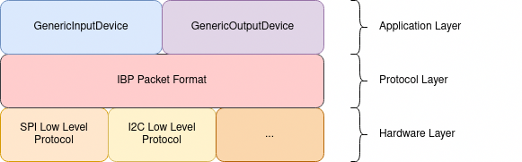
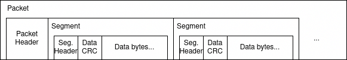
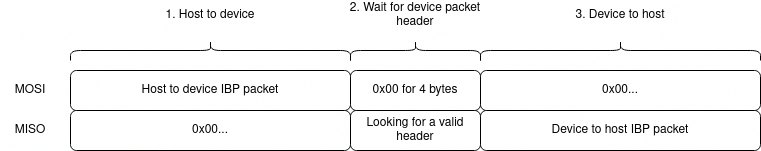

# Inter-Board Protocol

## Design Objectives
 * Works with various hardware protocols, such as SPI, I2C and Serial.
   * Half-duplex transfers as some protocols like I2C are not full-duplex.
 * Bandwidth efficient.
   * Length delimited packets. Packet size is dependent on how many data to transmit, vs fixed length.
 * Robust to errors.
   * Error detection with CRC and parity bit.
   * Will drop the offending packet. However, the future packets should not be affected by one erroneous packet.
 * Easy to parse and encode.
 * Extensible.

## Layers



The protocol consists of three layers:
1. Hardware layer: This layer implements the hardware specific protocols for sending and receiving the IBP packets. This is implemented in files like `spi.h` and `spi.cc`.
2. IBP Packet layer: This layer parses and encodes the IBP packet. This is implemented in `ibp_lib.h` and `ibp_lib.c`.
3. Application layer: This layer interprets the IBP packet and handles it in the framework of the existing devices. One example could be a `KeyboardOutputDevice`, which encodes the keycodes in IBP packet format. The base class is implemented in `ibp.h` and `ibp.cc`.

## IBP Packet Format



Each packet contains a packet header, and multiple segments. Each segment contains a segment header, 8-bit CRC for the data bytes, and the data bytes. The whole packet (including the packet header) is padded to a multiple of 4 bytes, largely due to the fact that RP2040 SPI RX interrupt only fires when there are 4 bytes in the RX queue.

### Packet Header
```
bit    7      6      5      4      3      2      1      0
+------+------+------+------+------+------+------+------+
|     total number of bytes incl. this header    |parity|
+------+------+------+------+------+------+------+------+
```
The total number of bytes includes the padding.

### Segment Header
```
bit    7      6      5      4      3      2      1      0
+------+------+------+------+------+------+------+------+
|   number of data bytes    |     field type     |parity|
+------+------+------+------+------+------+------+------+
```

## Hardware Layers

### SPI Low Level Protocol



Communication via SPI is driven by the host device. It generally involves three steps: 1. host sends the IBP packet to device, 2. host waits for the header of the device packet, so that the host knows how many bytes to read, 3. receive the remaining bytes of the device IBP packet.

This is how the three steps are carried out from host's perspective:

1. Host will start the transmission with the IBP packet it wants to send to the device. As IBP packet is 4-byte aligned, it sends at least 4 bytes, which is enough to trigger SPI RX interrupt on Pi Pico. At this step, host doesn't care about the duplex bytes from the device.
2. Once host packet is pushed out, host further sends 4 `0x00`s down the MOSI line, and wait for the corresponding 4 bytes from the device. This step creates a time delay for slower device to respond. Per protocol, the first non-zero byte the device sends will be the device packet header, and host looks for this header in the 4 response bytes. If no valid packet header is found, the transmission is treated as an error and terminates here. Otherwise, all the bytes, including and after the header will be saved for parsing.
3. Host keeps on chucking out `0x00`s to keep the device responding. From the header received in step 2, host knows how many bytes in total to expect from the device. This step will send out as many `0x00`s as the remaining bytes.

An example host implementation can be found in `linux/spi_module.c`.

This is how the three steps are carried out from device's perspective:

1. To save power, the device relies on the interrupt from SPI module to know when a transmission starts. On RP2040, the SPI RX interupt only happens when there are at least 4 bytes in the RX buffer (see the `SSPIMSC` register in section 4.4.4 of [RP2040 Datasheet](https://datasheets.raspberrypi.com/rp2040/rp2040-datasheet.pdf)). The interrupt handler maintains a buffer and keeps track of the packet size. If the buffer is empty, it expects the first byte to be a valid header. If so, it adds the data to the buffer, and otherwise wakes up the SPI task to handle the error.
2. When there are enough data in the RX buffer, as specified by the header, the RX interrupt handler wakes up the SPI task, as well as prefill the TX buffer and enables the TX interrupt. RX interrupt handler also masks out the future RX interrupt to ignore the `0x00`s from the host.
3. TX interrupt fires when there's less than 4 bytes in the TX queue. TX interrupt handler simply pushes the packet bytes into the queue, or notify the SPI task when there's no bytes remaining. When this happens TX interrupt handler also disables the TX interrupt. SPI main task then parses the RX packet, creates a new TX packet, and clears the RX and TX buffer if there's any remaining data. Before it goes into sleep, it unmasks the RX interrupt for the next transmission. 

See the details of the implementation in `spi.cc`.

## I2C Low Level Protocol
TODO
