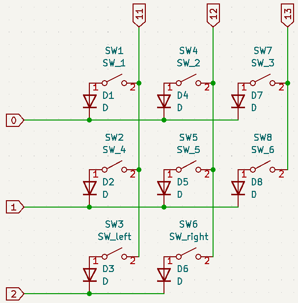
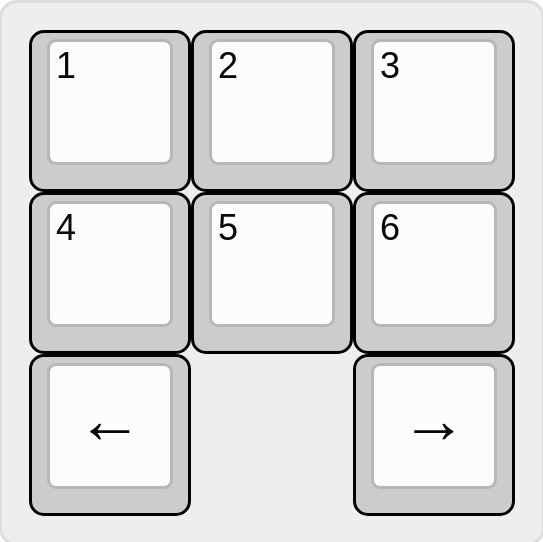

# Anatomy of layout.cc

This doc shows the structure of a `layout.cc` file, including what are the required elements of the file. For the also required `config.h` file, please take a look at the default config's `config.h` at `configs/default/config.h`. For this tutorial we'll use a toy keyboard layout with the following key matrix and setup:
| Schematic                         | Layout                         |
| --------------------------------- | ------------------------------ |
|  |  |

First, we need to include a helper file at the very top

```cpp
#include "layout_helper.h"
```

Then we need to define the required variables. Note that all the variables here should at least be `constexpr`.

```cpp
// Row GPIOs for the key matrix. Refer to the schematic.
static constexpr uint8_t kRowGPIO[] = {0, 1, 2};

// Column GPIOs for the key matrix. Refer to the schematic.
static constexpr uint8_t kColGPIO[] = {12, 13, 11};

// Specifies the direction of the diodes.
static constexpr bool kDiodeColToRow = true;
```

The first two variables specify the GPIOs used for the key matrix, and whether they are on the row direction or column direction on the schematic. The order doesn't matter here. The thrid variable specifies the direction of the diodes. In our case, current flows from column GPIO to row GPIO so it's set to `true`.

```cpp
static constexpr GPIO kGPIOMatrix[3][3] = {
  {G(0, 11), G(0, 12), G(0, 13)},
  {G(1, 11), G(1, 12), G(1, 13)},
  {G(2, 11), G(2, 12)},
};
```

`kGPIOMatrix` translates the **physical layout** of the keyboard to the GPIO wiring of each key. The `G` macro takes two parameters: the row GPIO and column GPIO. The `kGPIOMatrix` array has the shape of the maximum layout size so in our case it's 3x3 even though the bottom row only has 2 keys. The keys are represented in a row major left to right fasion, so for the bottom row even though in the physical layout the gap is in between the left arrow and right arrow, we still put them together next to each other.

```cpp
static constexpr Keycode kKeyCodes[][3][3] = {
  [0]={
    {K(K_1),     K(K_2),      K(K_3)},
    {K(K_4),     K(K_5),      K(K_6)},
    {K(K_ARR_L), K(K_ARR_R)},
  },
  [1]={
    {______,     K(K_B)},
    {K(K_A)},
    {K(K_ARR_U), K(K_ARR_D)},
  },
};
```

`kKeyCodes` defines the actual keymap, i.e. which switch does what when it's pressed. The first dimenion of the array is the layer, and the other two dimensions are the layout. The layout arrays should match up exactly with the `kGPIOMatrix`. Similar to `kGPIOMatrix` the order of each row is left to right compact. In this example, if layer 1 is active, the top left key will still be `1` and the one to its right will be `B`. The top right key will still be `3`. This is because that location will be zero initialized, which has the same effect as `______` (nop key). At this point, we have successfully defined the key layout.

```cpp
// Compile time validation and conversion for the key matrix. Must include this.
#include "layout_internal.inc"
```
`layout_internal.inc` is a required include, and has to be done after the layout definition. It checks and converts the layouts defined above at compile time (that why we need `constexpr` for the above variables), so that we don't need to do it at runtime.

At this point, if you compile and flash the firmware, the keyboard still won't do anything. It's because there's no device registered to scan the key matrix and handle the USB communication. We need to register those devices. Registration is similar to the traditional conditional compilation with macro setup, that only necessary code will be linked. Registration is better than conditional compilation as we don't need to have a centralized place for all the macros. For this example, we will register the only necessary device, the key scanner.

```cpp
static Status register1 = RegisterKeyscan(/*tag=*/0);
```

A few notes here. First, the return value has to be assigned to a static variable otherwise compiler will strip out the call. Second, each device needs a unique tag at registration. Other devices such as screen or joystick might need extra parameters. Please see their corresponding documentations.

The whole file looks like this:

```cpp
#include "layout_helper.h"

// Row GPIOs for the key matrix. Refer to the schematic.
static constexpr uint8_t kRowGPIO[] = {0, 1, 2};

// Column GPIOs for the key matrix. Refer to the schematic.
static constexpr uint8_t kColGPIO[] = {12, 13, 11};

// Specifies the direction of the diodes.
static constexpr bool kDiodeColToRow = true;

static constexpr GPIO kGPIOMatrix[3][3] = {
  {G(0, 11), G(0, 12), G(0, 13)},
  {G(1, 11), G(1, 12), G(1, 13)},
  {G(2, 11), G(2, 12)},
};

static constexpr Keycode kKeyCodes[][3][3] = {
  [0]={
    {K(K_1),     K(K_2),      K(K_3)},
    {K(K_4),     K(K_5),      K(K_6)},
    {K(K_ARR_L), K(K_ARR_R)},
  },
  [1]={
    {______,     K(K_B)},
    {K(K_A)},
    {K(K_ARR_U), K(K_ARR_D)},
  },
};

#include "layout_internal.inc"

static Status register1 = RegisterKeyscan(/*tag=*/0);
```

For next step you can take a look at the default layout at `configs/default/layout.cc` for [Pico-Keyboard](https://github.com/zli117/Pico-Keyboard). Please also take a look at the `layout_helper.h` for helper macros and keycodes.
